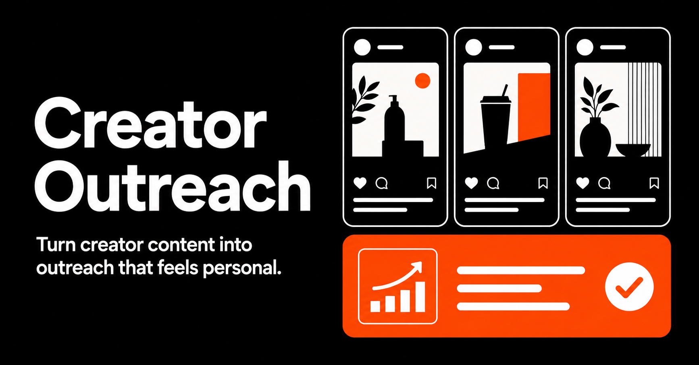

<div align="center">

# Creator Outreach

### 把红人最近聊过的内容，变成一封不像群发的建联信。

面向美区 TikTok Shop Affiliate BD：从近期视频转录、产品匹配，到个性化 DM / HTML 邮件生成与发送，一条工作流完成。

[🚀 在线体验](https://creator-outreach-bd.whole-sloth-5122.chatgpt.site/) · [🎨 查看 UI 设计规范](https://creator-outreach-bd.whole-sloth-5122.chatgpt.site/ui-tour)



| 业务现状 | 核心体验 | 产品目标 |
| :---: | :---: | :---: |
| 建联已读不回率最高约 **95%** | 本地约 **1 秒**生成 | 从模板群发走向 **有证据的个性化** |

</div>

## 目录

- [两分钟速览](#两分钟速览)
- [解决了谁的什么问题](#解决了谁的什么问题)
- [产品工作流](#产品工作流)
- [核心功能](#核心功能)
- [产品与技术取舍](#产品与技术取舍)
- [快速开始](#快速开始)
- [环境变量](#环境变量)
- [项目结构](#项目结构)
- [成功指标与下一步](#成功指标与下一步)

## 两分钟速览

**一句话：** 输入红人名称或粘贴视频脚本，系统从近期内容中提取可引用的真实细节，先在产品库中选出最匹配商品，再生成可编辑、可预览、可通过 Gmail 发送的个性化建联信。

```text
红人名称 / 视频脚本
        ↓
近 7 天视频与 Transcript
        ↓
内容信号 × 多产品匹配度 × 原文证据
        ↓
个性化 Icebreaker + DM + Email
        ↓
HTML/CSS 编辑、预览与 Gmail 发送
```

这不是“再生成一封更华丽的群发模板”，而是把 BD 最耗时的研究动作——**看视频、找细节、选产品、写破冰句**——压缩到一个可复核的操作面板中。

## 解决了谁的什么问题

### 👤 用户

每天需要批量开发美国本土带货达人的 TikTok Shop Affiliate BD 运营。

### 😣 高频痛点

红人每天会收到大量相似邀约。“看过你的视频，觉得很棒”没有任何辨识度，往往一眼就被识别为群发。为了写出真正自然的开场，BD 需要逐个打开红人近期视频，记录生活细节、人设和表达习惯，再人工寻找适合的产品，规模一大便难以持续。

### 💡 解法

| 传统流程 | Creator Outreach |
| --- | --- |
| 人工逐条观看近期视频 | 自动采集近 7 天公开视频，或手动粘贴 Transcript |
| 凭感觉选择推广商品 | 对整个产品库排序，展示匹配度、理由和原文证据 |
| 套用统一邮件模板 | 用红人真实内容生成具体 Icebreaker、DM 和 Email |
| 邮件样式依赖固定模板 | 支持图片、CTA、多占位符及自定义 HTML/CSS |
| 复制到邮箱后重新排版 | Gmail OAuth 绑定后直接发送 HTML 邮件 |

## 产品工作流

1. **Collect — 理解红人**  
   输入 YouTube 频道名称，拉取近 7 天内最新 3 条视频转录；也可以直接粘贴 TikTok、Instagram 或其他来源的脚本。

2. **Match — 先选对产品**  
   将红人的话题、场景与表达信号和多产品库进行匹配，先输出排序、匹配度、推荐理由和对应原文，再进入文案生成。

3. **Personalize — 写得像真的看过**  
   把可追溯的视频细节放进 Icebreaker，并生成可切换“更短 / 更随意 / 更少销售感”的 DM 与邮件版本。

4. **Review & Send — 人在回路中**  
   BD 可以编辑 Subject、正文、产品图、CTA、优惠信息和 HTML/CSS；预览确认后通过已绑定的 Gmail 发送。

## 核心功能

- 🔎 **双输入模式**：YouTube 近 7 天自动采集 + 手动 Transcript 兜底
- 🎯 **多产品智能匹配**：先排名，再生成；推荐结果附内容证据与来源
- ✍️ **定制化建联**：生成 Icebreaker、TikTok / IG DM 和 Email
- 🧩 **邮件模板系统**：支持 14 个动态占位符、自定义 HTML/CSS、产品图与 CTA
- 👀 **所见即所得预览**：发送内容与预览使用同一套渲染逻辑
- 📮 **Gmail 发送闭环**：OAuth 连接、UTF-8 Subject、HTML 邮件与内嵌图片
- 🗂️ **本地产品库与历史记录**：使用浏览器本地存储，无需额外数据库
- 🎨 **独立 UI Tour**：展示颜色、字体、组件、页面组合和动效规范

## 产品与技术取舍

当前 MVP 将**产品排序和文案组合保留在本地**：通过内容概念、关键词重合、产品特征和原文证据完成匹配，再使用可控模板生成结果。这一选择让演示稳定、响应快、成本低，也避免在未验证需求前过早引入复杂模型链路。

外部服务只用于两个明确环节：

- YouTube Data API + Supadata：查找频道、近期视频和 Transcript
- Google OAuth + Gmail API：授权并发送最终 HTML 邮件

| 层级 | 技术 |
| --- | --- |
| 前端与路由 | React 19 · Vinext · TypeScript |
| UI | Tailwind CSS · Base UI / shadcn · Lucide Icons |
| 本地状态 | `localStorage` |
| 外部集成 | YouTube Data API · Supadata · Gmail API |
| 部署运行时 | OpenAI Sites / Cloudflare Workers · Vercel / Nitro |
| 工程质量 | npm lockfile · oxlint · oxfmt |

## 快速开始

### 1. 安装环境

- Node.js `>= 22.13.0`
- npm

### 2. 安装并启动

```bash
git clone https://github.com/<your-name>/creator-outreach.git
cd creator-outreach
npm ci
cp .env.example .env.local
npm run dev
```

打开终端输出的本地地址即可使用。即使暂未配置外部凭据，仍可以通过**手动粘贴 Transcript**体验产品匹配与建联信生成。

### 3. 常用命令

```bash
npm run dev       # 本地开发
npm run build     # Sites / Cloudflare 生产构建
npm run build:vercel # Vercel 生产构建
npm run lint      # 代码检查
npm run format    # 代码格式化
```

## 环境变量

复制 `.env.example` 为 `.env.local`，然后填写以下配置：

```dotenv
YOUTUBE_API_KEY=
SUPADATA_API_KEY=
GOOGLE_CLIENT_ID=
GOOGLE_CLIENT_SECRET=
SITE_URL=http://localhost:3000
```

| 变量 | 用途 | 是否必需 |
| --- | --- | --- |
| `YOUTUBE_API_KEY` | 查找频道及近 7 天公开视频 | 自动采集时需要 |
| `SUPADATA_API_KEY` | 获取公开视频 Transcript | 自动采集时需要 |
| `GOOGLE_CLIENT_ID` | Gmail OAuth 登录 | 邮件发送时需要 |
| `GOOGLE_CLIENT_SECRET` | Gmail OAuth 换取令牌 | 邮件发送时需要 |
| `SITE_URL` | OAuth 回调所使用的网站地址 | Gmail 连接时需要 |

> [!IMPORTANT]
> `.env.local` 已被 Git 忽略。不要把 API Key、OAuth Secret 或访问令牌提交到仓库；公开演示前请使用受限密钥并轮换曾经暴露的凭据。

## 项目结构

```text
creator-outreach/
├── app/
│   ├── page.tsx                 # 采集、匹配、生成与邮件编辑主流程
│   ├── products/page.tsx        # 多产品库管理
│   ├── history/page.tsx         # 本地建联历史
│   ├── ui-tour/page.tsx         # UI 设计规范与关键页面展示
│   └── api/
│       ├── youtube/route.ts     # 视频与 Transcript 采集
│       └── gmail/               # OAuth、状态检查和邮件发送
├── components/                  # 导航、互动展示与 UI 组件
├── lib/
│   ├── products.ts              # 产品匹配与排序逻辑
│   └── email-template.ts        # 占位符、HTML/CSS 清洗与渲染
├── public/                      # 品牌与社交分享资源
└── .env.example                 # 无敏感值的配置模板
```

## 成功指标与下一步

这些数字是**需要通过真实 BD 使用验证的产品目标**，不是已经证明的业务结果：

| 指标 | 当前业务基线 / 观察 | 产品目标 |
| --- | --- | --- |
| 每封信的研究与撰写时间 | 需要逐条看视频并手写 | 降到约 1 分钟以内 |
| 单人日建联产能 | 约 20 封高质量定制信 | 10 分钟生成约 100 封初稿 |
| 建联回复率 | 模板群发约 3% | 个性化后向 15% 验证 |

下一阶段重点：

- 引入Youtube Shorts,tiktok, ins feeds等多渠道内容采集
- 引入结构化 LLM 提取，识别人设、语气、近期事件与负面约束
- 使用 Embedding + Reranker 提升大产品库中的召回与排序质量
- 建立“生成版本 → 是否发送 → 是否回复”的反馈闭环，验证匹配度与回复率关系
- 增加批量任务、团队模板、CRM 导出与权限管理

---

<div align="center">

**好的建联不是写得更像 AI，而是让红人感觉：你真的看过。**

</div>
